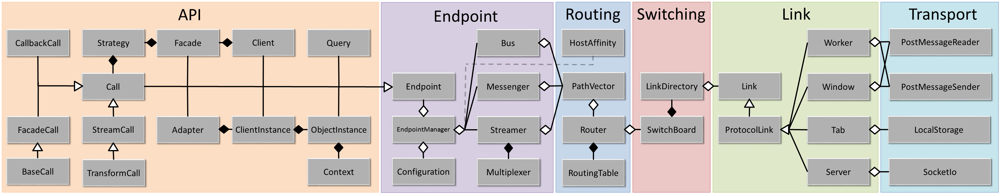

# Architecture

Endpoint.js consists of six layers.

* The transport layer sends messages to other instances of Endpoint.js through different protocols.
* The link layer manages all the connections for a specific type of transport, and performs the handshake.
* The switching layer manages the links and ensures that every unique host is represented within the routing layer exactly once by choosing the most efficient route to each host.
* The routing layer executes Zone Routing Protocol and routes packets internally and externally.  Additionally, it maintains affinity with external hosts and notifies the local Endpoint.js instance when remote hosts disconnect.
* The endpoint layer consists of stateless APIs to perform communication between different endpoint.js instances, as well as the eponymous 'endpoint' class that manages them for a single endpoint instance.
* The api layer consists of the stateful RPC and Eventing framework, which is built off the stateless APIs.
