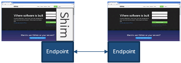
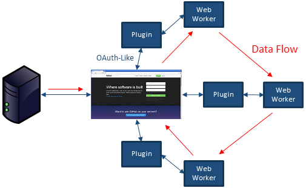

# Integration

- [Short Term: Low Cost of Entry](#short-term-low-cost-of-entry)
- [Long Term: Integrated, Performant Plugins](#long-term-integrated-performant-plugins)

## Short Term: Low Cost of Entry

Endpoint.js was designed with the goal of reducing cost and integration effort
between separate programs and applications. There are three primary ways we think you'll find the most benefit by
using Endpoint.js. The first two methods are described in this section, while the last is reserved for the next section:

 - Enabling multiple existing pages of my own website to communicate and send information to each other
 - Enabling multiple existing, full-screen web applications to communicate
 - Enabling multiple plugins to create a tailored, integrated view, offloading processing to web workers

Enabling communication within a single website is straightforward. Most web applications these days are written in a
service-oriented fashion, where existing front-end JavaScript libraries are used to access service endpoints and feed
data to a user interface. Endpoint.js can take advantage of these existing libraries by enabling developers to wrap
them with an Adapter. In most cases, this integration can be reduced to one line of code. Out of the box, Endpoint.js
will automatically discover instances of itself running in other contexts, such as Web Workers, iframes, tabs,
and windows. This can be useful if you want to keep track of everything the user is viewing for contextual purposes,
or offload heavy processing work to a web worker.

Enabling multiple existing websites to communicate provides the quickest win for new users of Endpoint.js. Using this
method allows ease of entry and low cost addition of cross application communication to your software stack. Because
this integration method requires low effort, it does not create an integrated view. The user will need to
switch between tabs or windows to use individual components of each application. You could, of course, use iframes
to host the individual applications within the same window. While this method is fully supported by Endpoint.js, it
has bad performance because each application is rendered and performs processing using only one CPU. Alternatively,
another solution would be to use a simple visual feature (or "shim") that can be added to each website to signify
a view or provide simple access to the other application to prevent un-needed tab switching. An example could be to
use a sidebar:

The following steps can be taken to create an integration:

    Step 1: Identify existing JavaScript services to share

Because Endpoint.js adapters are versionable, you can share the existing API and easily make changes with a future version.
Endpoint.js will automatically determine which functions are available and register that API. It ignores variables and
variables (or functions) starting with an underscore '_'.

    Step 2: Decide what applications you want to share your data with

Endpoint.js provides significant security features. All Endpoint.js instances connect to each other as nodes in an ad-hoc
network. This is similar to multiple computers connecting to each other over a local network (or the Internet). As such,
terms such as 'links' and 'bridges' such as you would find in a real network can be found within Endpoint.js.

    Step 3: Create a communication hub

The hub serves as a relay to transfer communication packets between all open applications. It does
this by using several techniques, such as cross-window communication, local storage, and shared web workers. See the
'cross origin' example (or the above diagram).

## Long Term: Integrated, Performant Plugins

Endpoint.js was created to shift the way large organizations develop web applications. Websites today have a service-based
backend, with a single frontend application typically based on JavaScript, or a combination of technologies such as
PHP and Java.

Future webapps will be composed of data spouts, sinks, and streaming enrichment engines on the server side. This
architecture will feed into a client-side application comprised of published APIs. These APIs cover data movement to simple
UI features, such as a Grid API (similar to bootstrap's grid capability for displaying UI elements), a Window API
to access events or perform global actions, and a sidebar API to manipulate visible components. A plugin
manager allows the user to compose their application and view by enabling plugins, which live in hidden iframes and/or
web workers. These plugins communicate with the main client window through an OAuth-like permissions framework created
specifically for inter-browser communication between cross-origin websites.

There are two key takeaways: 1) The user experience evolves as necessary without requiring a complete re-write, and 2)
data is streamed in real-time throughout the client application.

First, because site functionality is added via plugins, the main contractor responsible for delivering an initial capability
can help define the API and build the default versions of plugins. As functionality increases, newer versions of
existing plugins by individuals or other organizations can extend, enhance or replace the base capabilities.

Second, concepts such as Dataflow Programming enable static data route declarations, and Endpoint.js uses its remote
routing, strategy, and streaming capabilities to connect plugins with each other. Every plugin can
discover and use each other, and each can subscribe to the main client-side data flows and provide data enrichment
or transformation in a prioritized fashion. Each plugin enhances the user's view of data before it is routed
back for display or to another server-based data sink. As an example, a search could yield results which are fed through
a filter plugin, then a proximity search or clustering algorithm, and finally a data highlighting algorithm, before
being fed to the display. Each can be enabled, disabled, and configured as desired independently.

With this architecture, you get the benefit of a tailored view, where each plugin can contribute to
data enrichment or the way the user interacts with data, and the base application serves as an integration platform
with a set of APIs to guide the user experience based on corporate governance.
